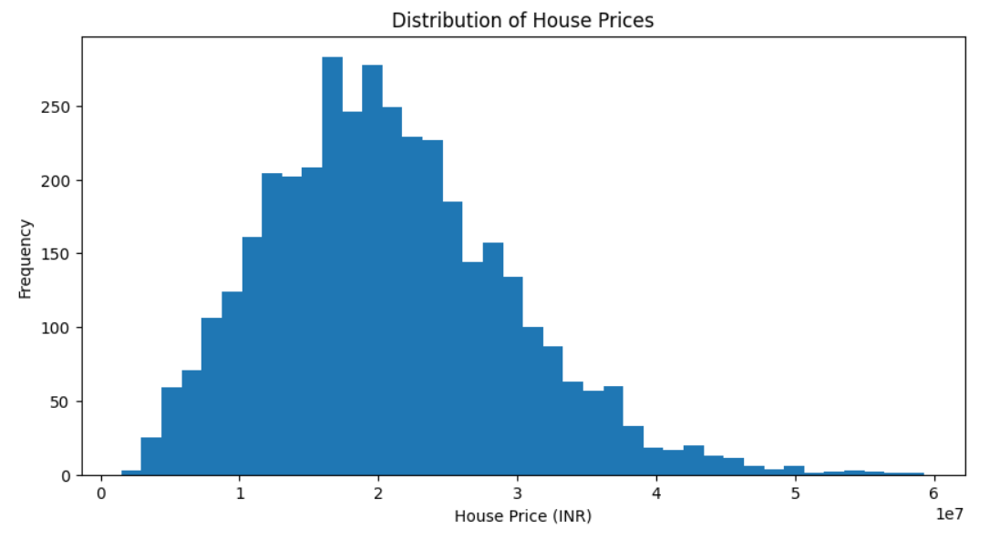
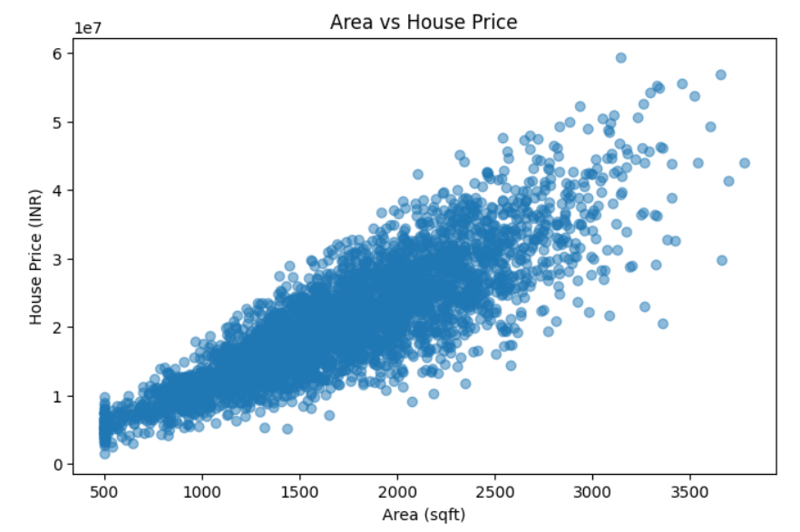
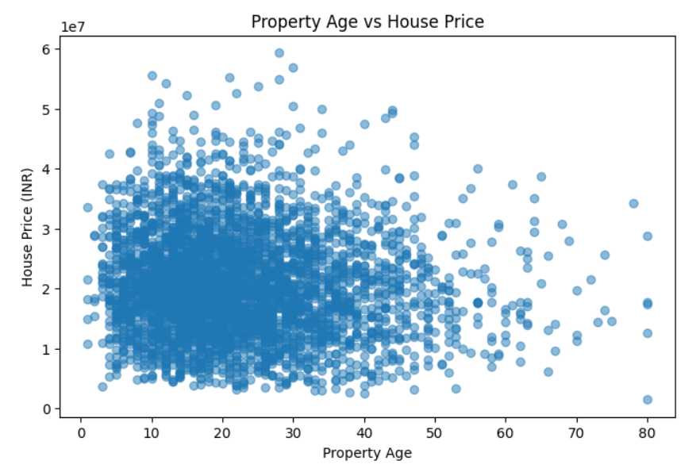
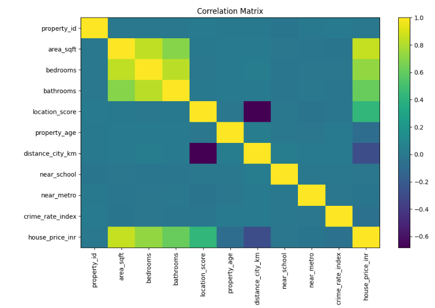
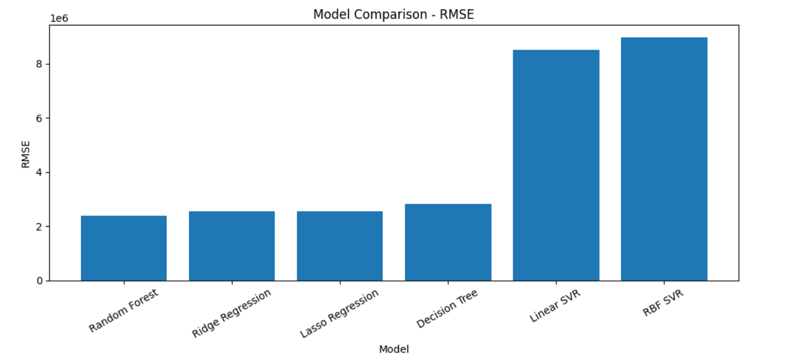
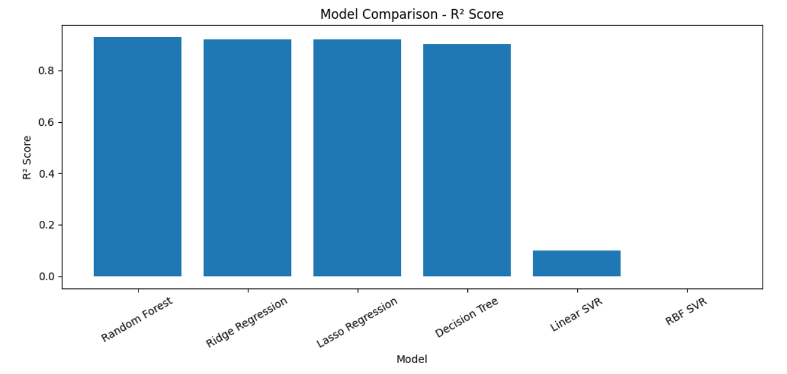
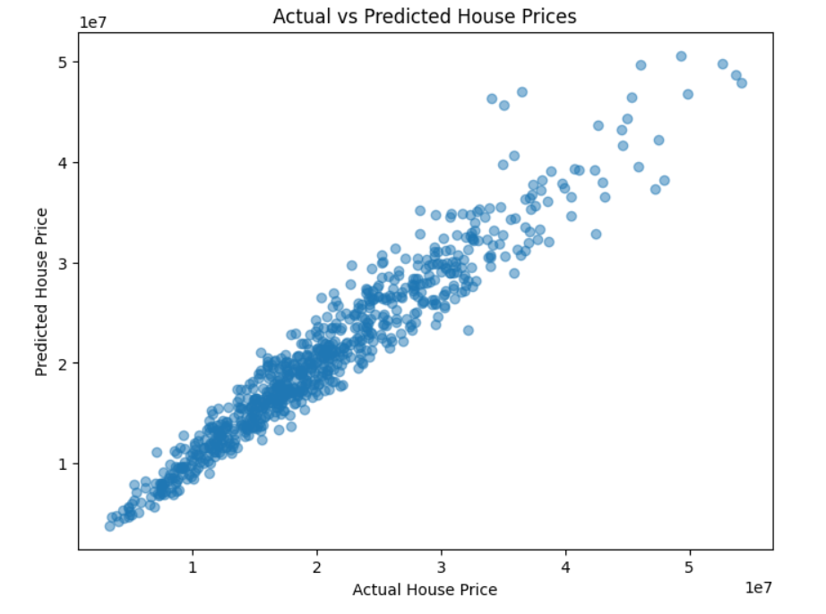

# 🏠 Robust Regression Engine

### 🧮 Supervised Learning & Regression Analysis

> A supervised machine learning project exploring regularization, cross-validation, linear and non-linear regression, model evaluation, and robust house-price prediction.

---

## ✨ Project Overview

**Robust Regression Engine** is a regression-focused project designed to build a more reliable house-price prediction workflow.

The project addresses a real-estate analytics scenario where a basic regression model suffers from **overfitting** and unstable predictions across different datasets. The project therefore focuses on regularization, validation strategies, model comparison, and generalization to unseen data.

### 🎯 Objectives

- Understand and prepare the real-estate dataset
- Apply **Ridge Regression (L2)**
- Apply **Lasso Regression (L1)**
- Tune regularization using cross-validation
- Compare different **cross-validation strategies**
- Implement **Decision Tree Regression**
- Implement **Random Forest Regression**
- Implement **Support Vector Regression (SVR)**
- Evaluate models using standard regression metrics
- Study **Overfitting** and **Underfitting**
- Compare linear and non-linear regressors
- Interpret the results from a practical real-estate perspective
- Prepare a working **Streamlit application**

---

## 🖼️ Project Visuals

### 📊 Screenshot Showcase

The repository contains project screenshots in the `screenshots/` folder.

| # | Visualization |
|---|---|
| 01 |  |
| 02 |  |
| 03 |  |
| 04 |  |
| 05 |  |
| 06 |  |
| 07 |  |


## 🗂️ Dataset

The project uses a **real-estate dataset** containing property and structural information for house-price prediction.

### 🎯 Target Variable

```text
House Price
```

### 🔎 Predictive Information

The project brief describes the dataset as containing:

- Property size and structural attributes
- Location-based numerical indicators
- Property age and renovation details

> `House Price` is treated as the target variable, while the remaining relevant property attributes are used as predictive features.

---

## 🧠 Mathematical & Machine Learning Concepts

### 1️⃣ Regularization

Regularization adds a penalty to the learning objective to control model complexity and reduce overfitting.

It is particularly important in this project because the existing regression model is described as producing unstable predictions across datasets.

---

### 2️⃣ Ridge Regression — L2

Ridge Regression applies an **L2 penalty** to the model coefficients.

It shrinks coefficients toward zero while generally retaining all predictors.

---

### 3️⃣ Lasso Regression — L1

Lasso Regression applies an **L1 penalty**.

It can shrink some coefficients completely to zero, making it useful for implicit feature selection.

---

### 4️⃣ Cross-Validation 🔁

The project compares multiple validation strategies:

- 🔹 K-Fold Cross-Validation
- 🔹 Stratified K-Fold Cross-Validation using binned target values
- 🔹 Leave-One-Out Cross-Validation (LOOCV)
- 🔹 Time Series Split

The purpose is to understand how validation strategy affects measured model performance and stability.

---

### 5️⃣ Tree-Based Regression 🌳

#### Decision Tree Regression

A Decision Tree models non-linear relationships using threshold-based splits.

Tree complexity can be controlled using parameters such as:

- `max_depth`
- `min_samples`

#### Random Forest Regression

Random Forest combines multiple decision trees into an ensemble and is compared with the performance of a single decision tree.

---

### 6️⃣ Support Vector Regression 🎯

Support Vector Regression is implemented using:

- Linear kernel
- Polynomial or RBF kernel

Important hyperparameters include:

```text
C
gamma
epsilon
```

These parameters are tuned to study their effect on regression performance.

---

## 📏 Model Evaluation

The regression models are evaluated using:

| Metric | Purpose |
|---|---|
| **MSE** | Measures average squared prediction error |
| **MAE** | Measures average absolute prediction error |
| **RMSE** | Measures prediction error in the target's unit |
| **R² Score** | Measures explained variation |

### 🏆 Model Selection

Model selection is based on **validation performance and generalization to unseen data**.

The project compares:

- Regularized Linear Models
- Tree-Based Models
- Support Vector Regression

No single model is assumed to be best before the validation results are obtained.

---

## ⚖️ Bias–Variance Analysis

The project examines training and validation/test behavior to identify model complexity issues.

### Underfitting

A model may be **underfitting** when it is too simple to capture important patterns in the data.

### Overfitting

A model may be **overfitting** when training performance is substantially stronger than validation/test performance.

### 🎯 Goal

Build a model that generalizes well to unseen real-estate data.

---

## 🔬 Project Workflow

```text
📥 Load Dataset
      ↓
🧹 Understand & Prepare Data
      ↓
🔀 Train–Test Split
      ↓
📏 Preprocessing / Scaling
      ↓
📉 Ridge Regression
      ↓
🧲 Lasso Regression
      ↓
🔁 Cross-Validation Strategies
      ↓
🌳 Decision Tree Regression
      ↓
🌲 Random Forest Regression
      ↓
🎯 Support Vector Regression
      ↓
📏 Model Evaluation
      ↓
⚖️ Overfitting / Underfitting Analysis
      ↓
🏆 Validation-Based Model Comparison
      ↓
🚀 Streamlit Application
      ↓
💼 Final Business Interpretation
```

---

## 🛠️ Tech Stack

- 🐍 **Python**
- 🐼 **Pandas**
- 🔢 **NumPy**
- 📊 **Matplotlib**
- 🎨 **Seaborn**
- 🤖 **Scikit-learn**
- 📓 **Jupyter Notebook**
- 🚀 **Streamlit**

---

📁 Repository Structure

## 📁 Repository Structure

```text
Robust-Regression-Engine/
│
├── Notebook/
│   └── Robust_Regression_Engine.ipynb
│
├── dataset/
│   └── Advanced_Regression_HousePrice_Dataset_3800.xlsx
│
├── app.py
│
├── Robust_Regression_Engine_Meet_mehta_12237
│
├──  Robust_Regression_Engine_Theory.pdf
│
├── requirements.txt
│
├── README.md
│
└── screenshots/
    ├── ss_1.png
    ├── ss_2.png
    ├── ss_3.png
    ├── ss_4.png
    ├── ss_5.png
    ├── ss_6.png
    └── ss_7.png

---

## 💼 Practical Applications

A robust house-price regression system can support:

- 🏠 Property valuation
- 💰 Pricing analysis
- 📈 Real-estate market analysis
- 💡 Investment evaluation
- 👥 Customer-facing property estimates

> ⚠️ Model predictions are estimates and should not be treated as guaranteed market prices.

---

## 📚 Learning Outcomes

Through this project, I explored how supervised-learning concepts can be applied to practical regression problems:

- Regularization and model complexity
- Ridge and Lasso regression
- Cross-validation strategies
- Linear vs non-linear regression
- Tree-based learning
- Support Vector Regression
- Regression evaluation metrics
- Overfitting and underfitting
- Generalization to unseen data
- Hyperparameter tuning
- Practical model interpretation

---

## 🚀 How to Run

### 1. Clone the repository

```bash
git clone <your-repository-url>
cd Robust-Regression-Engine
```

### 2. Install dependencies

```bash
pip install pandas numpy matplotlib seaborn scikit-learn jupyter streamlit
```

### 3. Launch Jupyter Notebook

```bash
jupyter notebook
```

Open the project notebook and run the cells from top to bottom.

### 4. Run the Streamlit Application

```bash
streamlit run app.py
```

> Make sure the dataset path used by the application matches the repository structure.

---

## 📌 Submission Deliverables

The project brief specifies the following deliverables:

- 📓 Source code / Jupyter Notebook
- 📊 Evaluation tables and plots
- 🚀 Working Streamlit application
- 📝 Final conclusions
- 🖼️ Screenshots
- 📄 Theory PDF
- 🌐 GitHub repository with README

---

## 🌟 Project Highlights

> **From regularization → validation → regression → evaluation → practical prediction.**

This project demonstrates a complete supervised-learning regression workflow with an emphasis on **model stability, generalization, and comparison of different regression approaches**.

---

## 👨‍💻 About Me

### **Meet Mehta**

I am **Meet Mehta**, and this is my personal **Supervised Learning & Regression** project.

Through this project, I explored how machine-learning and mathematical concepts can be applied to a practical real-estate prediction problem. I focused on understanding the complete workflow rather than treating the model as a black box.

### 🛠️ My Skills

- 🐍 **Python**
- 🐼 **Pandas**
- 🔢 **NumPy**
- 📊 **Matplotlib & Seaborn**
- 🤖 **Scikit-learn**
- 📓 **Jupyter Notebook**
- 📈 **Supervised Learning**
- 📉 **Regression Analysis**
- 🔁 **Cross-Validation**
- 🌳 **Tree-Based Machine Learning**
- 🎯 **Support Vector Regression**
- ⚙️ **Model Evaluation & Hyperparameter Tuning**
- 🚀 **Streamlit**

### 🎯 What I Practiced in This Project

- Building a complete regression workflow
- Comparing different machine-learning approaches
- Understanding regularization and overfitting
- Applying multiple cross-validation strategies
- Evaluating models with regression metrics
- Interpreting machine-learning results from a practical perspective

> **Personal Project:** Built and documented by **Meet Mehta** as part of my learning journey in supervised machine learning and regression.

---

### ⭐ If you found this project useful

Consider giving the repository a **star ⭐** and exploring the notebook to see the complete implementation and visual analysis.
